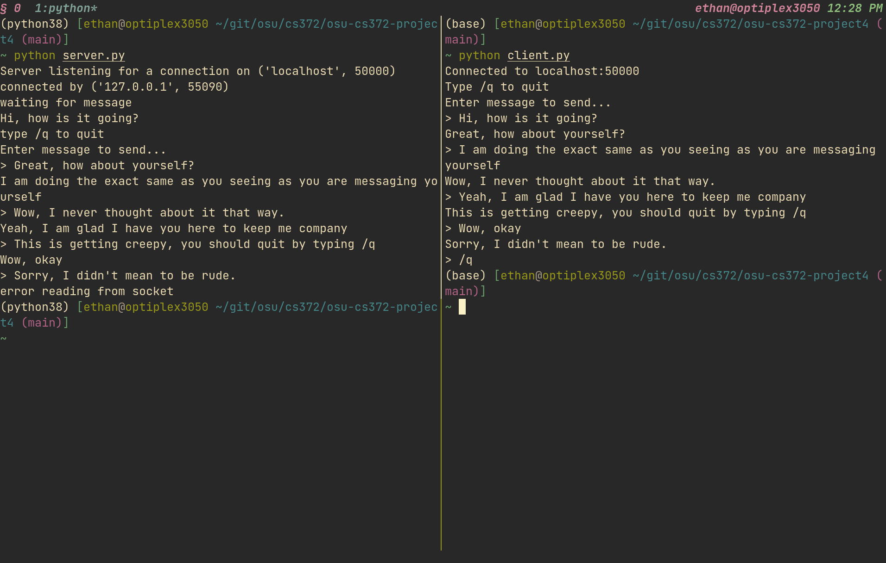

# Instructions

The server code is contained in the file `server.py` and the client code is
contained in the file `client.py`. The server needs to be running before the
client can connect to it. By default, both the client and the server connect to
`localhost:50000`. Since the OS may hang onto the port after exiting the
program, an optional argument can be passed on the command line to specify the
port. For example:

```python
python3 ./server.py 500001
python3 ./client.py 500001
```

If you would like to run the client and server on different machines on your
local network, simply change the value of `SERVER_NAME="localhost"` to
`SERVER_NAME="<ip address of the server>"` in both the files `server.py` and
`client.py`.


I have used the walrus operator, that is `:=`, in my python code which was
introduced in version 3.8. I have tested the code on python version 3.8 and
everything works as expected. I would bet that any version newer than 3.8 would
also be fine.

Additionally, the unit tests can be run by using `pytest` or `python -m
unittest`.

# Screenshots


